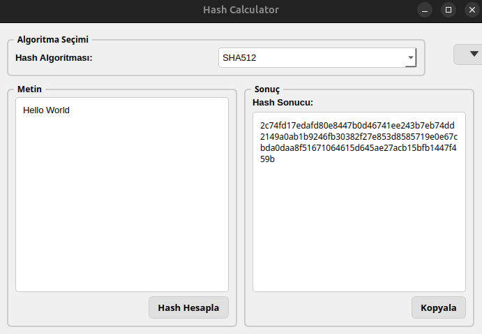
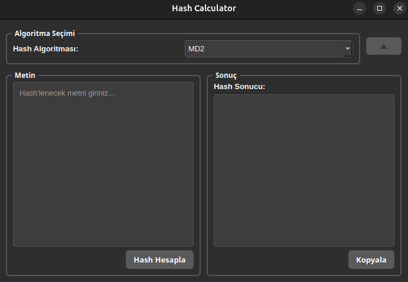

# Hash Calculator

Bu proje, çeşitli hash algoritmalarını kullanarak metinlerin hash değerlerini hesaplayan bir python uygulamasıdır.

## Özellikler

- MD2, MD4, MD5, SHA1, SHA-224, SHA256, SHA-384, SHA512, SHAKE-128, SHAKE-256, BLAKE2b, BLAKE2s ve CRC32 hash algoritmalarını destekler.
- Koyu ve açık tema arasında geçiş yapma imkanı sunar.

## Kurulum

1. Bu projeyi klonlayın:
    ```sh
    git clone https://github.com/brky06/hashcalculator.git
    cd hashcalculator
    ```

2. Gerekli bağımlılıkları yükleyin:
    ```sh
    pip install -r requirements.txt
    ```

## Kullanım

1. Uygulamayı başlatmak için aşağıdaki komutu çalıştırın:
    ```sh
    python src/main.py
    ```

2. Açılan pencerede hash algoritmasını seçin, hash'lemek istediğiniz metni girin ve "Hash Hesapla" butonuna tıklayın.

    - Örnek bir ekran görüntüsü:
      

3. Tema değiştirmek için sağ üst köşedeki tema seçici butonunu kullanabilirsiniz.

    - Tema değiştirme ekran görüntüsü:
      

## Proje Yapısı

```plaintext
hashcalculator/
    LICENSE
    README.md
    requirements.txt
    screenshots/
        hash_calculation.png
        copy_result.png
        theme_switch.png
    src/
        main.py
        ui/
            main_window.py
        utils/
            hash_utils.py
```
